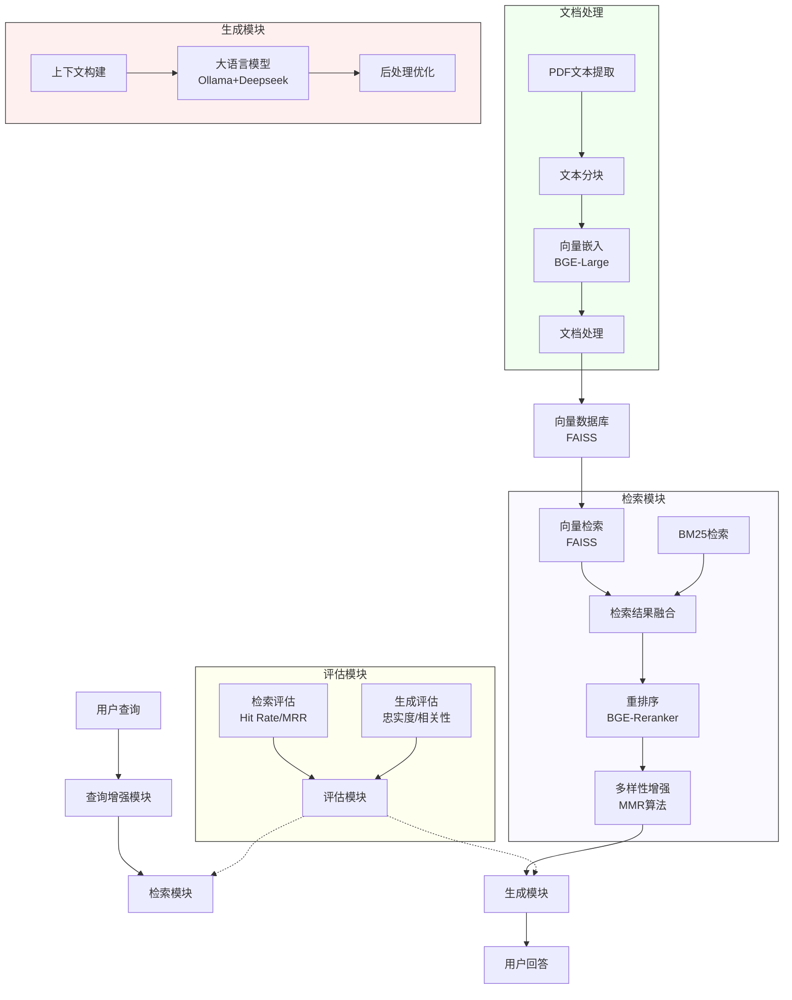

```mermaid
graph TD
    A[用户查询] --> B[查询增强模块]
    B --> C[检索模块]
    
    subgraph 检索模块
        C1[向量检索\nFAISS] --> D
        C2[BM25检索] --> D
        D[检索结果融合] --> E
        E[重排序\nBGE-Reranker] --> F
        F[多样性增强\nMMR算法]
    end
    
    G[文档处理] --> H
    H[向量数据库\nFAISS] --> C1
    
    subgraph 文档处理
        G1[PDF文本提取] --> G2
        G2[文本分块] --> G3
        G3[向量嵌入\nBGE-Large] --> G
    end
    
    F --> I[生成模块]
    
    subgraph 生成模块
        I1[上下文构建] --> I2
        I2[大语言模型\nOllama+Deepseek] --> I3
        I3[后处理优化]
    end
    
    I --> J[用户回答]
    
    K[评估模块] -.-> C
    K -.-> I
    
    subgraph 评估模块
        K1[检索评估\nHit Rate/MRR] --> K
        K2[生成评估\n忠实度/相关性] --> K
    end
    
    style 检索模块 fill:#f9f9ff,stroke:#333,stroke-width:1px
    style 文档处理 fill:#f0fff0,stroke:#333,stroke-width:1px
    style 生成模块 fill:#fff0f0,stroke:#333,stroke-width:1px
    style 评估模块 fill:#fffff0,stroke:#333,stroke-width:1px
``` 